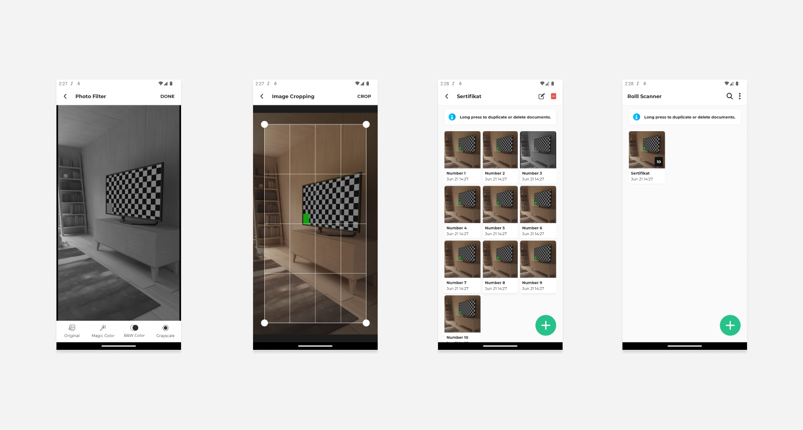
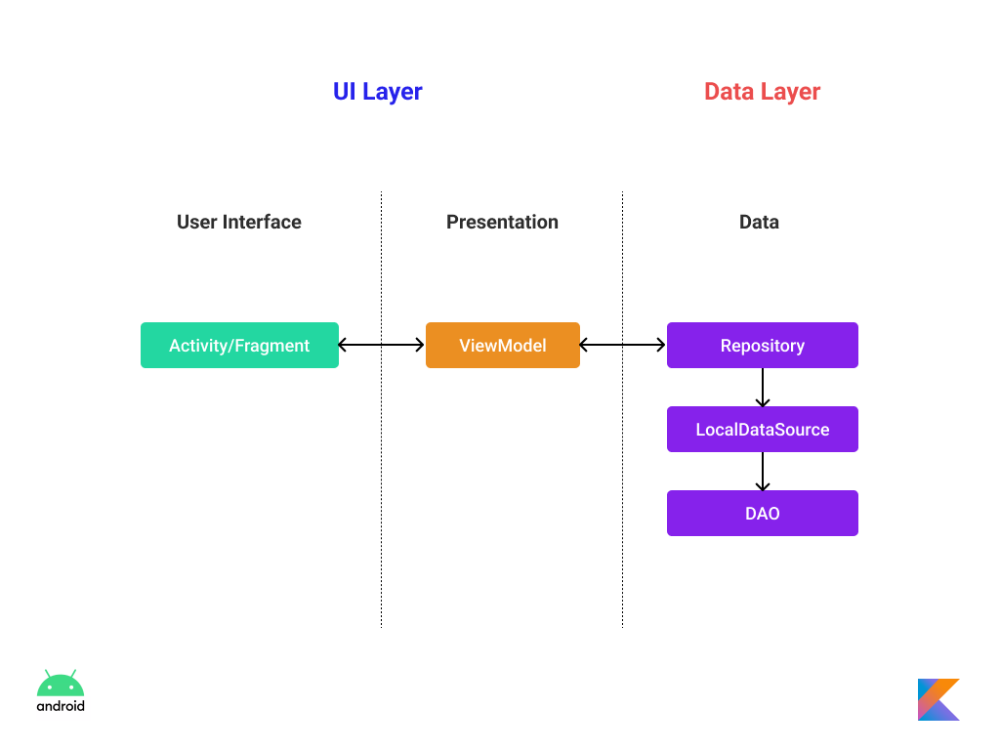
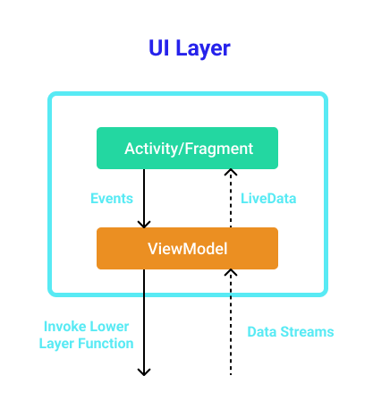

<h1 align="center">RolllPDF - Document Scanner</h1>

<p align="center">  
🗡️ RolllPDF helps you to scan document like CamScanner
</p>

<p align="center">

</p>

## How to clone
- If you are using https `https://github.com/Codingle-House/RolllPDF.git`
- If you are using SSH `git@github.com:Codingle-House/RolllPDF.git`

## Tech Stack and Library
- Minimum SDK level 21
- [Kotlin](https://kotlinlang.org/)
- Jetpack
    - Lifecycle: Observe Android lifecycles and handle UI states upon the lifecycle changes.
    - ViewModel: Manages UI-related data holder and lifecycle aware. Allows data to survive configuration changes such as screen rotations.
    - Room: Constructs Database by providing an abstraction layer over SQLite to allow fluent database access.
    - Proto Datastore: Data storage solution to save key-value pairs or typed object with [Protocol Buffer](https://protobuf.dev/)
    - [CameraX](https://developer.android.com/media/camera/camerax): Built to help make camera app development easier.
    - [Hilt](https://dagger.dev/hilt/): for dependency injection.
- Architecture
    - MVVM Architecture (View - ViewModel - Model)
    - Repository Pattern
- Other Libraries
    - Glide: Image loading and caching library
    - [PhotoFilter](https://github.com/mukeshsolanki/photofilter): Use to manipulate images. Put in local module and only use spesific filter.
    - [EasyPermission](https://github.com/googlesamples/easypermissions) -> Easily manage android permission

## Architecture Overview

<h3>RolllPDF is based on the MVVM architecture and the Repository pattern</h3>


The overall architecture of **RolllPDF** is composed of two layers; the UI layer and the data layer. Each layer has dedicated components and they have each different responsibilities, as defined below:

**RolllPDF** was built with [Guide to app architecture](https://developer.android.com/topic/architecture), so it would be a great sample to show how the architecture works in real-world projects.

### UI Layer



The UI layer consists of Activity/Fragment that could interact with users and [ViewModel](https://developer.android.com/topic/libraries/architecture/viewmodel) that holds app states and restores data when configuration changes.
- Activity/Fragment observe the data by using [ViewModel](https://developer.android.com/topic/libraries/architecture/viewmodel)

```
Designed and developed by 2020 pertadima (Irfan Pertadima)

Licensed under the Apache License, Version 2.0 (the "License");
you may not use this file except in compliance with the License.
You may obtain a copy of the License at

   http://www.apache.org/licenses/LICENSE-2.0

Unless required by applicable law or agreed to in writing, software
distributed under the License is distributed on an "AS IS" BASIS,
WITHOUT WARRANTIES OR CONDITIONS OF ANY KIND, either express or implied.
See the License for the specific language governing permissions and
limitations under the License.
```
